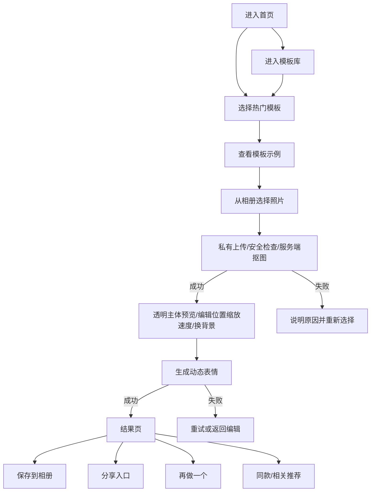

# 表情工坊免费 MVP v1.0 产品规格

**状态：** 可进入原型与开发规划  
**日期：** 2026-09-22  
**暂定名称：** 表情工坊  
**产品一句话：** 上传一张人物或宠物照片，快速生成可以保存和分享的动态表情。

## 1. 本阶段目标

第一阶段只验证一件事：普通微信用户是否愿意完成“选择模板 → 上传照片 → 生成 → 保存或分享”的完整闭环。

本阶段不验证收入，也不建设商业系统。

### 成功条件

- 用户不需要学习即可在 2 分钟内完成第一次生成。
- 生成成功率达到 70% 以上。
- 成功生成后的保存率达到 30% 以上。
- 成功生成后的分享意图率达到 8% 以上。
- 人均成功生成作品数达到 2 个以上。
- 首轮获得 100～300 名真实测试用户；需求成立目标为 1000 MAU。

以上指标是项目内部 Go / No-Go 标准，不是行业基准。

## 2. 明确不做

- 不做会员系统。
- 不接微信支付。
- 不做订单、退款、优惠券、发票或权益账户。
- 不接广告。
- 不做自动续费、次数包或高级模板付费拦截。
- 不做社交社区、评论、关注或公开作品广场。
- 不做管理后台；模板先随版本发布。
- 不做聊天、AI 对话或开放式 AI 生图。
- 不在本阶段同时开发 H5、App 或其他小程序端。

## 3. 目标用户与场景

### 目标用户

- 想在微信群、私聊或朋友圈使用个性表情的普通用户。
- 想把朋友、情侣、宠物或同事照片做成趣味动图的用户。
- 不会使用 Photoshop、AE 或专业 GIF 工具的轻量用户。

### 主要使用场景

- 聊天斗图。
- 朋友之间恶搞。
- 情侣互动。
- 宠物表情。
- 打工人、节日与热点表达。

## 4. 产品范围

第一阶段拆成两个连续交付包，避免相互独立的功能拖慢核心闭环。

### v1.0：表情生成核心闭环

- 6 个模板可浏览：摸头、摇头、打脸、亲亲、爆哭、无语；本轮只承诺摸头模板完整生成，其他模板补齐素材并独立验收前不得标记为可生成。
- 模板浏览与详情。
- 从相册选择人物或宠物照片。
- 自动裁切与抠图。
- 调整人物位置、缩放和播放速度。
- 生成 GIF。
- 结果预览、保存到相册、分享入口、再做一个。
- 我的作品，保留最近生成记录。
- 核心漏斗埋点。

### v1.1：实用 GIF 工具包

- 视频转 GIF。
- 多图转 GIF。
- GIF 压缩。
- GIF 裁剪。

v1.1 仍属于第一阶段，但必须等 v1.0 核心生成链路稳定后单独规划和开发；它不阻塞 v1.0 测试上线。

## 5. 核心用户流程



## 6. 页面结构

### 6.1 首页

**目标：** 让用户在 2 秒内理解产品，并在一次点击内进入制作。

页面内容：

- 标题和一句话价值说明。
- “上传照片开始制作”主按钮。
- 6 个热门模板卡片。
- “查看全部模板”入口。
- 最近一次未完成或已完成作品入口；没有历史时不显示。
- GIF 工具入口仅在 v1.1 发布后出现。

验收：

- 首屏只有一个主操作。
- 点击模板进入对应模板详情。
- 点击主按钮先选择图片，再进入默认热门模板的编辑页。

### 6.2 模板库

**目标：** 快速找到想做的表情，而不是浏览成品图库。

页面内容：

- 分类筛选：热门、搞笑、互动、情绪。
- 模板卡片：动态预览、名称、简短说明。
- 6 个模板可以全部访问，不设置锁定态。

验收：

- 切换分类不会丢失滚动位置。
- 模板预览加载失败时显示静态首帧。
- 点击卡片进入模板详情。

### 6.3 模板详情

**目标：** 在上传照片前明确告诉用户会生成什么。

页面内容：

- 模板动效预览。
- 一句效果说明。
- 照片建议，例如“正脸、无遮挡、主体清晰”。
- “选择照片制作”主按钮。

验收：

- 未获得相册权限时，在用户主动点击后发起权限请求。
- 用户拒绝授权时，解释用途并提供打开设置入口。

### 6.4 编辑器

**目标：** 让自动结果默认可用，同时允许少量修正。

页面内容：

- 摸头模板展示服务端返回的透明主体合成效果，默认使用模板原背景。
- 背景选择：模板原背景、浅蓝、奶油杏、淡紫；背景选择与最终 GIF 一致。
- 可切换摸头动作叠加预览；动作层在透明主体上方。
- 更换照片。
- 拖动人物位置。
- 缩放滑杆。
- 速度三档：慢、标准、快。
- 透明主体默认最大边长为画布的 55%，按原始抠图比例适配；初始位置和缩放与生成端一致。
- “生成表情”主按钮。

验收：

- 摸头模板完成安全检查和抠图后即可看到透明主体合成预览；失败时保留原照片并提供重试/换图，未抠图成功不可生成。
- 拖动和缩放均限制在可见区域内。
- 背景、主体位置、缩放和速度均传入生成请求，生成 GIF 与编辑器一致。
- 重复点击生成按钮只创建一次任务。
- 离开页面前，如果存在未生成的调整，提示是否放弃。

### 6.5 处理中

**目标：** 降低等待焦虑，并让失败可恢复。

页面内容：

- 当前阶段文案：上传中、处理中、合成中。
- 进度反馈采用阶段状态，不展示虚假的精确百分比。
- 取消入口只在上传阶段提供。

验收：

- 网络中断时提示重试，不清空当前编辑参数。
- 处理失败时展示可理解原因，并提供“重新生成”和“更换照片”。

### 6.6 结果页

**目标：** 最大化保存、分享和连续创作。

页面内容：

- GIF 循环预览。
- “保存到相册”主按钮。
- 分享入口。
- “再做一个”。
- 3 个相关推荐模板。

验收：

- 保存前请求相册写入权限。
- 保存成功与失败均有明确反馈。
- 分享卡片使用作品静态首帧和模板名称，不暴露用户原图。
- “再做一个”保留当前照片处理结果，避免重复抠图。

### 6.7 我的作品

**目标：** 找回近期作品，不建设复杂个人中心。

页面内容：

- 按时间倒序展示最近作品。
- 每项显示静态首帧、模板名、生成时间。
- 进入作品详情后可再次保存、分享或删除记录。

验收：

- 结果文件已过期时显示“作品已过期，可重新制作”，不展示损坏预览。
- 删除操作需二次确认，仅删除当前作品。

## 7. 模板系统

每个模板由配置和素材组成，新增模板不能要求新增页面或业务流程。

```json
{
  "id": "pat-head",
  "name": "摸头",
  "category": "interaction",
  "durationMs": 2400,
  "fps": 15,
  "canvas": { "width": 480, "height": 480 },
  "subject": {
    "defaultX": 240,
    "defaultY": 278,
    "defaultScale": 1,
    "minScale": 0.65,
    "maxScale": 1.6
  },
  "layers": [
    { "type": "background", "asset": "background.png" },
    { "type": "subject" },
    { "type": "animation", "asset": "foreground.webm" }
  ]
}
```

要求：

- 画布统一为 480 × 480。
- 输出 GIF 目标大小不超过 8 MB。
- 每个模板必须提供动态预览和静态首帧。
- 模板配置必须通过自动校验后才能进入目录。
- 模板素材不得依赖运行时远程下载的未知文件。

## 8. 图片处理与生成

处理链路：

```text
选择照片
→ 校验格式和大小
→ 私有上传、内容安全检查
→ 服务端主体识别与抠图
→ 保存私有透明主体临时图并返回短期预览 URL
→ 编辑透明主体、背景和动效参数
→ 复用同一主体和编辑参数生成 GIF
→ 输出 GIF 和静态首帧
→ 写入作品记录
```

输入约束：

- 支持 JPG、JPEG、PNG。
- 单张原图不超过 10 MB。
- 短边不得低于 320 px。
- 一次只处理一张照片。

容错：

- 没有识别到主体时，要求用户重新选图。
- 多主体图片默认选取画面占比最大的主体，并允许用户重新选择照片。
- 抠图结果不可用时，不继续生成错误 GIF。
- 摸头模板生成 GIF 时复用已抠透明主体，不在生成阶段重复抠图。
- 首轮只有摸头模板接通透明主体预处理、换背景与生成；其他模板不可据此视为已验收。

## 9. 数据与生命周期

MVP 只需要三类业务数据：

### Template

- `id`
- `name`
- `category`
- `previewUrl`
- `coverUrl`
- `sortOrder`
- `enabled`

### Work

- `id`
- `openid`
- `templateId`
- `status`: `processing | ready | failed | expired`
- `sourceFileId`
- `sourceExpiresAt`
- `subjectFileId`
- `subjectExpiresAt`
- `uploadTicketId`
- `resultFileId`
- `coverFileId`
- `editorState`
- `failureCode`
- `createdAt`
- `expiresAt`
- `deletedAt` (仅用户删除后的短期清理 tombstone)

### AnalyticsEvent

- `eventName`
- `openidHash`
- `templateId`
- `workId`
- `sessionId`
- `properties`
- `occurredAt`

生命周期：

- 未完成抠图的上传票据有效期为 15 分钟；抠图成功后，原图和透明主体从处理完成时起保留 24 小时，供当前生成和“再做一个”复用。
- 未消费票据对应的源图与透明图到期后由每小时任务清理；已消费文件由 Work 生命周期清理。任务正常时物理删除通常晚于到期不到 1 小时，故障或积压时可能更久。
- 生成结果默认保留 30 天。
- 用户主动删除作品时，立即从列表隐藏并删除 GIF/封面；为确保 24 小时源图清理仍有可追踪记录，服务端短暂保留已去除用户/编辑信息的最小 tombstone，到期清理文件后删除 tombstone 与 consumed 上传票据。

## 10. 核心埋点

| 事件 | 触发时机 | 核心属性 |
|---|---|---|
| `home_view` | 首页完成展示 | `sessionId` |
| `template_view` | 打开模板详情 | `templateId` |
| `photo_select_start` | 点击选择照片 | `templateId` |
| `photo_select_success` | 完成选择并通过本地校验 | `templateId`, `sizeKb` |
| `editor_view` | 自动处理成功进入编辑器 | `templateId` |
| `generation_start` | 点击生成并成功创建任务 | `templateId`, `workId` |
| `generation_success` | GIF 生成完成 | `templateId`, `durationMs`, `outputKb` |
| `generation_fail` | 生成失败 | `templateId`, `failureCode` |
| `work_save_success` | 保存相册成功 | `workId` |
| `work_share_tap` | 点击分享入口 | `workId`, `templateId` |
| `create_again_tap` | 点击再做一个 | `workId`, `nextTemplateId` |

只记录产品行为，不上传通讯录、相册列表或与核心功能无关的个人信息。

## 11. 隐私与内容安全

- 首次使用图片能力前说明用途：图片仅用于生成用户选择的表情作品。
- 隐私指引必须列出图片、相册权限、生成文件、用户标识的用途与保存周期。
- 原图和中间文件不得设为公开读取。
- 分享卡片不得包含原始照片地址。
- 所有上传图片在处理前经过内容安全检查。
- 日志不得记录图片二进制、永久访问地址或用户敏感信息。
- 提供作品删除入口；公开发布前完成备案、隐私指引与类目核对。

## 12. 技术方向

- 小程序前端：Taro 4.x、React、TypeScript。
- 微信身份、数据库、存储与函数：CloudBase；work-api 校验上传票据归属，并在服务端完成内容安全检查后请求抠图。
- 媒体处理：Python 3.11、FastAPI、Pillow、FFmpeg，部署到 CloudBase 云托管。
- 模板配置：JSON Schema 校验。
- 单元测试：Vitest（TypeScript）与 Pytest（Python）。
- 真机验收：微信开发者工具 + 至少一台 iOS 与一台 Android 设备。

采用 Taro 是为了保持 React/TypeScript 的开发效率，不代表第一阶段要同时发布 H5。CloudBase 的小程序调用链可以直接携带微信用户身份，媒体服务使用云托管承载较重的 FFmpeg 与图像处理任务。

## 13. 发布前验收

- 摸头模板完成上传、安全检查、抠图、拖动/缩放、四种背景选择、速度调整和 GIF 生成；其他模板素材补齐并完成端到端验证前明确标为未完成。
- 首次用户可在 2 分钟内完成一个作品。
- 超大、过小、损坏、无主体和不支持格式均有明确提示。
- 重复点击不会产生重复作品。
- 保存、分享入口、再做一个和作品历史均可用。
- 原图、中间文件和结果文件按生命周期清理。
- 核心埋点能还原完整漏斗。
- iOS 与 Android 真机各完成一次全流程。
- 不存在会员、支付、订单、广告或付费暗示入口。

## 14. 后续决策门槛

达到以下条件后，再讨论广告或会员：

- 至少 1000 MAU。
- 生成成功率大于 70%。
- 保存率大于 30%。
- 分享意图率大于 8%。
- 高级模板、高清或去广告等付费意图有真实数据支持。

在此之前，不新增支付相关开发。
